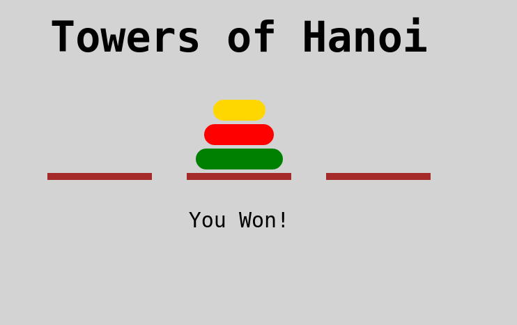

# Towers of Hanoi

[Live Link](https://brentluna.github.io/towers_of_hanoi/)

## Description

It's a browser version of the classic game, Towers of Hanoi.

## Technologies
- JavaScript
- CSS
- jQuery
- HTML

I used JavaScript to handle the games logic, and a combination of JavaScript and jQuery to handle the DOM manipulation as the user interacts with it via clickHandlers.
